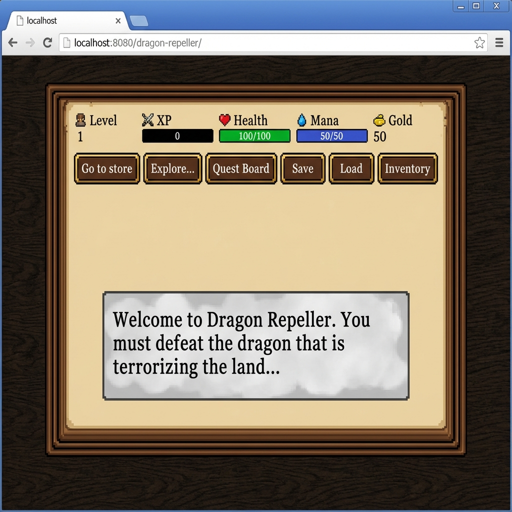

# Medieval RPG Adventure

A feature-rich text-based RPG built with HTML, CSS, and vanilla JavaScript. Originally a simple learning project, it has been massively expanded into a full-fledged medieval adventure game.

## Features

### Core Gameplay
- **Turn-Based Combat**: Fight monsters with attacks, magic spells, and items.
- **Progression**: Gain XP to level up, increasing your max health and mana.
- **Economy**: Earn gold from battles and quests to buy better gear and potions.
- **Save/Load**: Your progress is saved locally so you can continue your adventure later.

### Advanced Mechanics
- **Magic System**: Cast **Fireball** for massive damage or **Heal** to recover health using Mana.
- **Inventory**: Manage your items (potions, weapons) via a dedicated inventory screen.
- **Quest System**: Visit the **Quest Board** to accept missions, track your progress, and turn them in for rewards.
- **Critical Hits**: Attacks have a chance to deal double damage.
- **Loot Drops**: Monsters can drop useful items like Health Potions.

### Visuals & Audio
- **Medieval Aesthetic**: Wood textures, parchment panels, and classic serif fonts.
- **Visual Feedback**: Health bars, floating damage numbers, and screen shake effects.
- **Sound Effects**: Retro-style generated sound effects for combat, UI, and victory.

## Game Flow

1.  **Start in the Town Square**: Your central hub.
2.  **Visit the Store**: Buy weapons, potions, and heal up.
3.  **Check the Quest Board**: Pick up a bounty to earn extra gold.
4.  **Explore**: Travel to the Cave, Swamp, or Mountain to fight unique monsters.
5.  **Fight**: Use your sword and spells to defeat enemies.
6.  **Win**: Defeat the Dragon to win the game!

## Development History

This project evolved through several development phases:

- **Phase 1: Core Systems**
    - Implemented Leveling System (XP, Max Health).
    - Added Save/Load functionality using `localStorage`.
- **Phase 2: Content Expansion**
    - Added new areas: Swamp, Mountain.
    - Added new monsters: Goblin, Orc, Ghost.
    - Created an "Explore" menu.
- **Phase 3: Advanced Mechanics**
    - Implemented Mana System and Magic Spells (Fireball, Heal).
    - Added a basic Quest System.
- **Phase 4: UI & Polish**
    - Visual overhaul with animations (Damage Shake, Fade-ins).
    - Improved layout and styling.
- **Phase 5: Gameplay Depth**
    - Added Visual Health Bars.
    - Implemented Floating Combat Text (Damage numbers).
    - Added Critical Hits and Loot Drops.
- **Phase 6: Medieval Theme & Inventory**
    - Complete visual redesign (Wood/Parchment theme).
    - Added a functional Inventory System with usable items.
    - Added Mana Potions.
- **Phase 7: Enhanced Quests**
    - Created a dedicated Quest Board with multiple quest choices.
    - Improved quest completion feedback.
- **Phase 8: Quest Turn-in & Sign**
    - Implemented manual quest turn-in mechanic.
    - Styled the quest tracker as a wooden sign.
- **Phase 9: Sound Effects**
    - Implemented a Web Audio API sound engine.
    - Added sounds for clicks, attacks, hits, and victory.

## How to Play

1.  Clone or download the repository.
2.  Open `index.html` in a web browser.
3.  Use the buttons to navigate, fight, and explore!

## Technologies Used

- HTML5
- CSS3 (Animations, Grid/Flexbox)
- JavaScript (Game Logic, Web Audio API, DOM Manipulation)

## License

This project is for educational purposes and is released under the MIT License.
